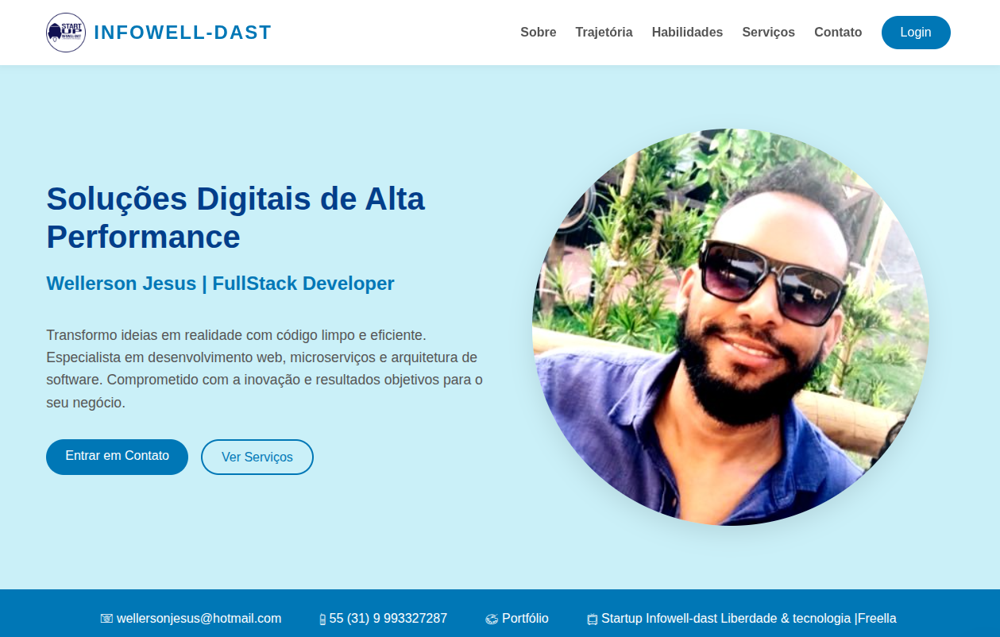

# LandPage

Scaffold leve para Landing Pages com Painel Administrativo (PHP + SQLite).



## 🚀 Quick Start

1. **Configurar**
   ```bash
   cp .env.example .env
   # Edite o .env com suas credenciais
   ```

2. **Instalar**
   ```bash
   php backend/scripts/init_db.php
   ```

3. **Rodar**
   ```bash
   php -S localhost:8000
   ```

## 🔗 Acesso

----
| Área | URL | Credenciais |
|---|---|---|
| **Landing Page** | http://localhost:8000/frontend/public/ | - |
| **Admin** | http://localhost:8000/frontend/admin/login.html | Admin (`.env`) ou `user@example.com` / `123456` |
| **API Docs** | http://localhost:8000/backend/docs/ | - |

## 📡 Endpoints da API

Principais rotas utilizadas pelos controllers e disponíveis para consumo:

| Método | Endpoint | Descrição |
|---|---|---|
| **POST** | `/backend/api/auth/login.php` | Autenticação (Login) |
| **GET** | `/backend/api/auth/logout.php` | Encerrar sessão (Logout) |
| **GET** | `/backend/api/auth/me.php` | Dados do usuário logado |
| **GET** | `/backend/api/dashboard/metrics.php` | Métricas do Dashboard |
| **GET** | `/backend/api/services/services.php` | Listar serviços (Admin) ou `?public=1` |
| **POST/PUT/DELETE** | `/backend/api/services/services.php` | Gerenciar serviços (Admin) |

---

<div align="center">
© JesusWellerson | Development | SRE | Software Architect | Software Engineer
<br>
</div>
